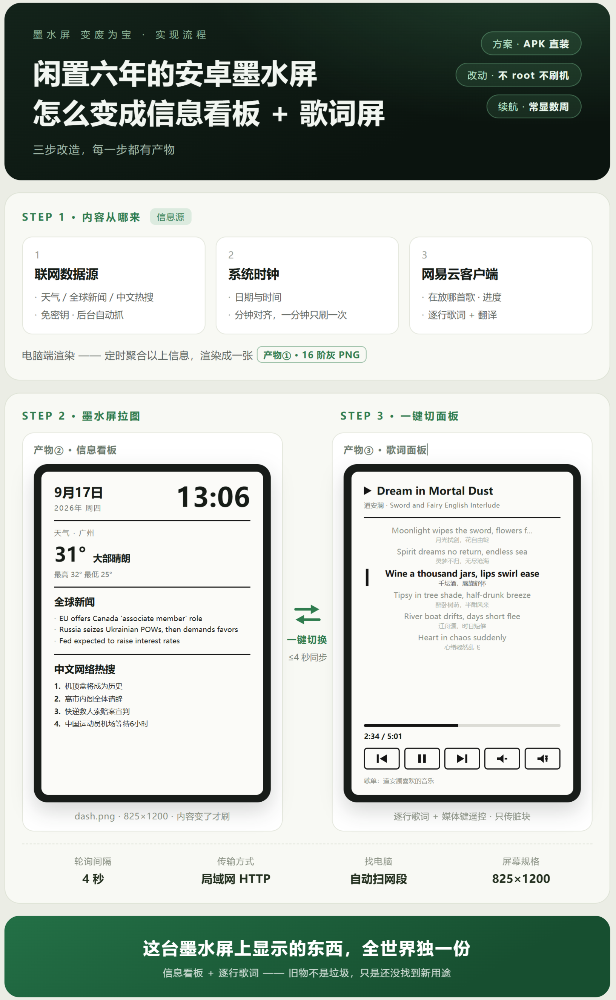
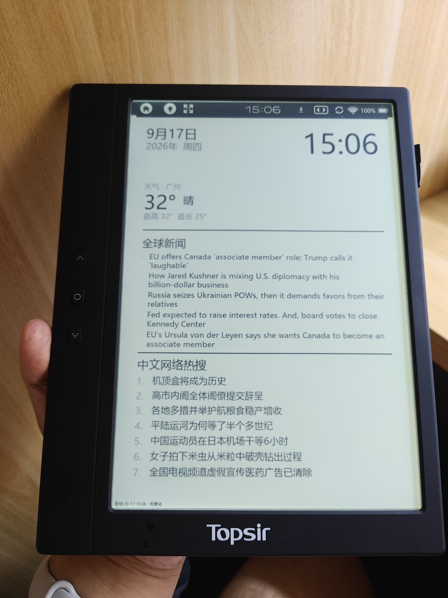

# H9Dash —— 把吃灰的安卓墨水屏变成信息看板 + 网易云歌词面板

> **Turn a dusty Android e-reader into a Wi-Fi dashboard and a music lyric panel.**
> PC 渲染一张 16 阶灰 PNG，设备通过局域网 HTTP 拉取并全屏显示。

专为 **海尔 topsir H9** 打造，但适用于任何能装 APK 的 **Android 4.0+** 墨水屏设备
（文石 Onyx N96 / M96 系、以及同类贴牌机应该都能直接用）。

```
   PC（Python）                                        设备（Android）
┌───────────────────────────┐                    ┌────────────────────────┐
│ ① 信息看板                 │  GET /dash.png?rev=N│  H9Dash.apk            │
│   日期时间 / 天气           ├───────────────────▶│                        │
│   全球新闻 / 中文热搜        │  内容没变只回一行 JSON│  一个轮询循环，每 4 秒： │
│                            │  ← 不刷屏，不闪       │   ① 问 /panel 该看哪个  │
│ ② 网易云歌词面板            │  GET /music/crops  │   ② 按答案取图          │
│   歌名 / 逐行歌词 / 翻译     │◀──── 脏块 PNG ─────┤      · 看板 → 整图/跳过 │
│   进度  ← WASAPI 峰值 + 自建钟│  POST /cmd         │      · 歌词 → 只贴脏块  │
│   控制  ←──────── 媒体键注入 ─┼──── {"action"} ──▶│                        │
│                            │                    │  翻页键 / 触摸分区      │
│ ③ 面板归属（谁说看哪张图）   │  GET /panel         │                        │
│   电脑 GUI 一点就切 ◀────────┼─── 免 token 轮询 ──┤  长按菜单也能切，同一份 │
│                            │                    │                        │
│  /health ← 报出门牌号+token  │◀── 扫网段自动发现 ──┤  ④ IP 变了自动找上门    │
└───────────────────────────┘                    └────────────────────────┘
```

**不需要 root、不需要越狱、不刷机、不动系统分区** —— 只要设备允许安装第三方 APK 就行。
装完之后它依然是一台正常的电子书阅读器，随时退出回书架。

**换了网络也不用碰设备**：PC 的 IP 一变，设备开机首帧失败就会自己扫局域网找到服务，
连 token 一起拿到并写回配置。详见 [自动找电脑](#自动找电脑ip-变了不用管)。

**换了想看的面板也不用碰设备**：在 PC 的 GUI「服务」页点一下按钮，
或者在设备上长按屏幕选一下 —— 两边改的是同一份状态，最多 4 秒就同步。






---

## 为什么不是 Kindle 那套？

Kindle 上的 `kindle-dashboard` / `kindle-calendar` 这类项目，得先越狱装 KUAL 才能跑 shell 脚本
（用 `curl` 拉图 + `eips` 上屏）。

而这台 H9 本质是一台 **开放的 Android 4.0.4 平板**（文石 Onyx 血统，装有
`com.onyx.android.data`、`com.onyx.kreader`）。它不需要越狱——一个自写的 APK 就能完成
"定时拉图 + 上屏"，而且因为 E-Ink 静态显示不掉电，续航是 **数周** 而不是
Kindle 那种 15 秒重绘方案的 0.5~1 天。

---

## 快速开始

### 0. 不想装 Python？用打包好的 exe（推荐给大多数人）

从 **Releases** 下载两个文件，放进同一个文件夹：

| 文件 | 说明 |
|---|---|
| `H9Dash 控制台.exe` | PC 端控制台 + 服务（免 Python，双击即用） |
| `H9Dash.apk` | 设备端 App |

双击 exe 就能用，界面和源码版是同一个。只有几处不同：

- 设置、缓存、输出图放在 `%APPDATA%\H9Dash\`（单文件 exe 每次运行会被
  解压到随机临时目录，数据不能跟着它走）；
- 「放行防火墙」点一下就行 —— Windows 会弹一次 UAC 确认框，点「是」，
  规则永久生效，不用再去管理员 PowerShell 里贴命令；
- 「设置开机自启」写的是注册表 Run 键（登录后后台自动起服务，不弹窗口）；
- exe 里内嵌了一份 APK 兜底，但**旁边的 apk 优先** —— 更新 apk
  不用重新下 exe。

看完从「3. 部署到设备」接着走就行。想自己编 exe：`python build_exe.py`。

### 1. 安装依赖（源码方式）

需要 **Python 3.8+**。Windows 上装官方 Python 时记得勾 **"tcl/tk and IDLE"**，
GUI 依赖 tkinter（官方安装包默认带，但部分精简版 / 嵌入式 Python 没有）。

```powershell
python -m venv .venv
.venv\Scripts\pip install -r requirements.txt
```

只要 `pillow` 和 `numpy`，GUI 本身零依赖（tkinter 是标准库）。

> 启动脚本的 Python 探测顺序是：
> **项目 `.venv` → 已知可用的绝对路径 → `py -3` / `pyw -3` → `PATH` 上的 `python(w)`**。
> 优先用 `pythonw` 是为了**不弹黑色控制台窗口**；而且**校验用的解释器和真正启动的是同一个**
> ——启动前会用它对 `import tkinter, PIL` 做一次检查，缺组件就明确报错，
> 而不是像以前那样"查一个、启动另一个"然后静默退出。
>
> 排障时改用 `start_gui_console.bat`，它会保留控制台窗口，报错和 traceback 都能看见。

### 2. 启动图形界面

双击 **`start_gui.bat`**，或者：

```powershell
python topsir_gui.py
```

GUI 有四个标签页：

| 标签页 | 能干什么 |
|---|---|
| **服务** | 启动/停止看板服务、看实时日志、**一键切换平板显示信息看板还是歌词面板**、复制设备取图地址、放行防火墙、设置开机自启、渲染预览图 |
| **看板内容** | 改城市、新闻/热搜条数，看三个联网源的上次更新时间，**立即刷新**；天气、新闻、热搜都是自动抓的 |
| **音乐** | 网易云歌词面板的**实时预览** + 播放控制（上一首/播放暂停/下一首/音量/喜欢）+ 歌词校准 + **歌词提前量**（让歌词比歌早 N 秒切句），改版式不用碰设备 |
| **设备** | 选盘符一键部署 APK + 配置（含开机兜底面板）、读取设备真实分辨率、手动改 `dashboard.conf` |

### 3. 部署到设备

**先准备 `H9Dash.apk`**（二选一）：

- 从 **Releases** 页下载（最省事）
- 或者自己编译：`cd android && python build.py` —— 产物落在仓库根目录

然后：

1. H9 用 USB 线接电脑，等它挂成盘符（如 `G:`）
2. GUI「设备」页 → 选盘符 → 选**开机兜底面板** → 点 **部署 APK + 配置**
3. 在设备上：文件管理器 → 点 `H9Dash.apk` → 安装 → 打开

> 只要部署一次。以后想换面板**不用再插 USB** —— 在 GUI「服务」页点一下就行（见下）。

> 命令行也行：`python deploy.py --drive G: --mode music`

#### 以后怎么换面板？在电脑上点一下

「服务」页有一排按钮：**◀ 信息看板 / 歌词面板 ▶ / ⇄ 切换**。

点下去改的是 **PC 端服务里的面板状态**。平板每 4 秒问一次服务端"现在该看哪个"，
所以**最多 4 秒**就会自己翻过去 —— 不用碰平板、不用重装、不用改配置。

平板上**长按屏幕**弹出的菜单里也能切，走的是同一个状态，所以两边看到的永远一致。

> 如果提示无法安装，去「设置 → 安全」勾上**未知来源**。
> H9 的海尔定制 UI 把「安全」菜单藏了，但默认值其实是允许的——直接试装就行。
> 若确实被禁，可关机后按 **电源 + 圆键**（翻页键中间那个，它是 Back）进 recovery 刷补丁包，
> 详见 `docs/device-facts.md`。
>
> ⚠️ **如果提示「应用签名不一致」**，说明设备上装的是用别的密钥签名的版本
> （比如你自己早先用生成的新密钥编过一次）。先在设备上卸载 H9Dash，再装这一个。
>
> `android/debug.keystore` 是**仓库自带**的签名密钥，**别删**：
> 它是调试密钥（口令就是公开的 `android`/`android`），提交进仓库就是为了
> **让所有人编出来的 APK 签名一致** —— 这样升级只要覆盖安装。
> 删了它下次编译会现场生成一把新密钥，签名就变了，以后每次升级都得先卸载。

### 4. 确认分辨率（可选但推荐）

第一次打开 H9Dash，它会把屏幕信息写到设备盘的 `h9dash_screen.txt`。
在 GUI「设备」页点 **读取**，然后按真实分辨率调整画布尺寸，画面就是 1:1 像素，不拉伸不裁切。

---

## 命令行用法

不想开 GUI 也完全可以：

```powershell
# 启动服务（默认 0.0.0.0:8765，同时提供信息看板和歌词面板）
python dashboard\server.py

# 开机就显示歌词面板（之后照样能随时切）
python dashboard\server.py --panel music

# 横版 1200x825
python dashboard\server.py --landscape

# 只提供信息看板，不要音乐面板
python dashboard\server.py --no-music

# 歌词面板只看不控（不下发媒体键）
python dashboard\server.py --read-only

# 歌词 5 行、默认关掉翻译
python dashboard\server.py --music-lines 5 --no-trans

# 只渲染一张图看看效果
python dashboard\render.py

# 部署到设备（--mode 只是"开机兜底"，不是现场开关）
python deploy.py --drive G: --mode music

# 不用 GUI 也可以切面板
curl -X POST "http://127.0.0.1:8765/panel?t=<token>" -d "{\"panel\":\"music\"}"
curl "http://127.0.0.1:8765/panel"     # 看当前是哪个（免 token）
```

服务启动后会打印全部地址：

```
http://192.168.1.100:8765/panel                 ← 当前该看哪个面板（免 token，设备问这个）
http://192.168.1.100:8765/dash.png?rev=0&t=...  ← 信息看板，设备用这个（带变化检测）
http://192.168.1.100:8765/music.png?t=...       ← 歌词面板整帧
http://192.168.1.100:8765/music/crops?t=...     ← 设备用的脏块接口
```

---

## 网易云歌词面板

把 H9 变成网易云音乐的**外接歌词屏 + 遥控器**：PC 上放着歌，墨水屏上显示当前歌名、
7 行歌词（当前句加粗 + 左侧竖条）、翻译、进度条和播放控制按钮。

### 它不碰客户端的任何数据

这一条是硬约束，也是整个设计的前提：

| 会做的事 | 不会做的事 |
|---|---|
| 读客户端自己写的 `webdb.dat`（**只读**打开） | ❌ 不写 `webdb.dat` / 不改缓存文件 |
| 读窗口标题拿当前曲目 | ❌ 不开 CDP / 调试端口 |
| 用系统媒体键（`SendInput`）下发播放控制 | ❌ 不注入 DLL / 不 hook 进程 |
| 调网易云的公开 HTTP 接口取歌词 | ❌ 不代理、不劫持音频流 |
| 自己按"墙钟 + 播放事件"算进度 | ❌ 不假装自己是播放源 |

所以客户端该弹广告弹广告、该升级升级，这个面板都能继续用。

### 四条链路，都是"试出来的"

**① 当前在放什么 —— 靠窗口标题，不能靠数据库**

`historyTracks` 表看着很美好（有曲目 id、时长、精确起播时刻），但**它会停更**。
实测：窗口标题已经播到 `As The World Goes Away`，`historyTracks` 最新一行还停在
12 分钟前的另一首歌——一旦客户端切到 AI 漫游之类不受它管的场景，它就不写了。

所以策略是**两条腿走路**：窗口标题永远跟得上（每次切歌都变），拿歌名再去
`dbTrack`（5000+ 首）**反查 id 与时长**；只有在标题读不到时才退回数据库那一行。

标题也读不到 id 的歌（不在本地曲库、又是电台/漫游来的），会拿歌名去
**线上检索**补一个 id——但**宁缺勿错**：歌名必须归一化后精确匹配（≥6 分）才认，
否则宁可显示"歌词未找到"，也不要挂着别人的歌词。

**② 播放还是暂停 —— 只能看 WASAPI 峰值电平**

音频会话的 `state` 在暂停时**仍然是 `1 (Active)`**，靠它判断会永远显示"播放中"。
实测唯一可靠的是默认输出设备的峰值表（`IAudioMeterInformation`）：
峰值 > 0.0008 就是出声，连续两次静音才判定为暂停（迟滞，避免句间空隙误判）。

**③ 播到第几秒 —— 自己攒一个时钟**

网易云 PC 端**不发布 SMTC**（枚举 0 个会话），也不暴露任何 player/state 接口。

```
进度 = now - 起播时刻 - 累计暂停 + 人工偏移     （夹到 [0, 时长]）
```

对齐点按可靠性排序：
1. **切歌** —— 曲目变了就归零重排；
2. **`playingCount` 新行** —— 客户端每"一首停下来"就写一行，
   `updateTime - playDuration` 就是这一轮真正的起播时刻，精确到毫秒；
   单曲循环时 `historyTracks` 不新增但这里会新增，所以循环也能被发现；
3. **循环回绕** —— 进度顶到末尾且仍在出声，就把起点往前滚整轮。

手动拖了进度条自建时钟发现不了，面板上有 **对早5s / 对晚5s / 重新对齐** 三个按钮手工校正。

**④ 播放控制 —— 系统媒体键注入**

| 动作 | 按键 |
|---|---|
| 播放 / 暂停 | `VK_MEDIA_PLAY_PAUSE`（0xB3） |
| 上一首 / 下一首 | `Ctrl + Alt + ←/→` |
| 音量 － / ＋ | `Ctrl + Alt + ↓/↑` |
| 喜欢 | `Ctrl + Alt + L` |

> 顺带一个坑：`Ctrl + Alt + P` **不是**播放暂停（被客户端注册到别处去了），
> 只有 `VK_MEDIA_PLAY_PAUSE` 稳定可用。

### 歌词提前量：两种"提前"动的是完全不同的两层

用户说的"歌词对不上"其实有两种，修法**相反**，所以要分成两个东西：

| 现象 | 该用哪个 | 动了什么 | 副作用 |
|---|---|---|---|
| **自建时钟本身偏了**（整首歌都对不上） | `lyric_earlier` / `lyric_later`（对早5s / 对晚5s） | 直接移动 `position_ms` | 进度条、剩余时间**一起**偏 |
| **歌在正常走，只是屏上显示慢半拍** | **歌词提前量**（`lyric_lead_ms`） | 只移动"哪一句算当前句"的取值基准 | 进度条**不动**（已逐像素验证） |

墨水屏"取图 → 屏上真的变了"有约 **0.6 秒**的固有延迟，再叠加进度按整秒量化，
屏上的歌词天生比耳朵慢一点。提前正好补回来 —— 而且**歌词早出现不影响阅读**
（人读一句要好几秒），晚出现才难受，所以这个方向上"提前"是净收益。

实现上只有一行：

```python
pos      = qpos                                    # 进度仍按真实值走（进度条不受影响）
lyric_pos = pos + max(0, int(self.lyric_lead_ms))  # 只有"选哪句"用提前后的基准
window   = lyrics_obj.window(lyric_pos, ...)
```

**默认 2.0 秒**（= 这一句结束前 2 秒就滚到下一句）。可选 0 / 0.5 / 1 / 1.5 / 2 / 2.5 / 3 / 4 / 5 秒，
**0 = 关闭**（歌播到哪句就显示哪句）。

三个入口，改的是同一个值：

- **电脑 GUI**「音乐」页 → 「歌词提前量」→ 填秒数 → 应用
- **设备面板**底部的「提前量」按钮 → 循环切换档位（按钮上会显示当前值）
- **HTTP**：`POST /cmd?t=TOKEN {"action":"set_lyric_lead","ms":2000}`

> ⚠️ 有个**必须成对**的坑：唤醒时刻也得用同一个基准扣掉提前量。
> 渲染用 `pos + lead` 选句 → 画面在"歌词时刻 − lead"就变了；
> 如果唤醒点还报"歌词时刻"，设备会**等那次变化过去了才醒** —— 白跑一趟，屏上反而更晚。
> 所以 `service.py` 里 `next_change_ms` 的计算也要减掉同一个 `lead`。
>
> 另一个坑：提前量越界（已经开始提前了）时**不能给 `None`** ——
> `clock.next_change_ms` 会把 `None` 当成"这首歌没有歌词行"，退回只靠整秒边界唤醒，
> **比给个超过当前时刻的值更慢**。正确做法是给 `pos + 1`（立刻醒）。

### 墨水屏是这么被伺候的

这一块是整个项目里最费心思的部分，因为它决定了"能不能长时间用"。

**① 歌词面板不闪屏。** 信息看板半小时刷一次，可以每次黑白闪一下去残影；
但歌词每 2~3 秒就要更新一次，再闪就等于一直在闪。所以音乐模式**默认整屏不闪**，
残影交给 `flash_min`（默认 20 分钟）定时整屏刷一次来清。

**② 只贴脏块。** 渲染器把画面切成"块"（标题、每一行歌词、进度条、按钮区），
逐块和上一帧比像素，只报告真正变了的矩形。服务端 `/music/crops` 一次请求
把这些矩形**连 PNG 一起**原子返回（base64）。实测一帧 825×1200 的整图是 67 KB，
而"进度条跳一下"只要 **1.6 KB**——省 97.5%。

```
帧 N       整帧 67 KB          ← 首次 / 掉帧 / 整屏重画时才走这条
帧 N+1     脏块 1.6 KB  ─┐
帧 N+2     脏块 ~9 KB   ─┼─  正常播放都是这条
帧 N+3     脏块 ~9 KB   ─┘
```

**③ 帧号防错拼。** 脏块是"相对上一帧"算出来的，所以设备必须刚好持有上一帧。
设备每轮把自己手里的 `frame_id` 传回去（`?from=N`），服务端决定：

| 设备手里的帧号 | 服务端返回 |
|---|---|
| `N == 当前帧号` | `up_to_date` —— 画面上什么都没有变，什么都不用传 |
| `N == 当前帧号 - 1` | 只回变了的那几个矩形 |
| 其它（首次 / 掉帧） | 回整帧，设备重铺底图 |

把判断放在服务端，设备端就只剩下"拼接"一件事。**拼接不会错，错了也不会花**——
帧号对不上时服务端直接回整帧。

**④ 按"下次画面什么时候变"睡觉。** 服务端知道下一句歌词在多少毫秒后出现、
进度数字什么时候跳秒、歌曲什么时候结束，于是告诉设备"睡 N 毫秒再拉"。
空转久了还会自动退避，最长 15 秒一次。

### 设备端交互

| 操作 | 行为 |
|---|---|
| **翻页上 / 下键** | 上一首 / 下一首 |
| **圆键（Back）** | 留给系统，**不拦截** |
| **点击面板按钮** | 触摸分区由服务端随画面一起下发，设备只做坐标命中 |
| 其它按键 | 写进设备盘 `h9dash_keys.log`，同时上报到 PC 的 `logs/keys.log` |

触摸分区**改版式不用改 APK**：服务端画按钮的同时把矩形一起给设备，设备按
FIT_CENTER 的缩放/留白换算坐标。实测 10 个分区全部命中，缩放后的上下留白也不会误触。

> H9 的翻页键键码目前按标准的 `PAGE_UP=92` / `PAGE_DOWN=93` 映射。
> 如果设备上按了没反应，看 `h9dash_keys.log` 里记的真实键码，
> 改 `dashboard.conf` 的 `key_prev` / `key_next` 即可（**不用重新编译 APK**）。

### 已经试过、明确行不通的路

写在这里免得以后重复踩：

| 方案 | 结论 |
|---|---|
| `orpheus://` 深链接切歌单 | ❌ 只注册了协议处理器，但那是 CEF 内部 scheme（`native/start.html`），不是深链接。处理器 0.35 秒就退出，客户端毫无反应；两次 25 秒对照实验对队列/曲目/标题零影响 |
| SMTC（系统媒体控制）读进度 | ❌ 客户端根本不发布媒体会话，`winrt_utils.dll` 都没加载 |
| 读客户端本地歌词缓存 | ❌ 3.1.40 上 `webdata\lyric\` 目录**根本不存在** |
| 读桌面歌词窗口的文本 | ❌ 那个窗口是自绘的（无子控件），拿不到任何文本 |
| 让设备直接跑网易云 | ❌ Android 4.0.4 装不了现代客户端，而且这台只有 825×1200 灰度屏 |

所以**歌单/队列是只读展示**：面板底部会显示当前歌单名，但不提供切歌单（做不到）。
单曲、上一首、下一首、音量、播放暂停这些**真能控**的都有。

### 接口一览

| 接口 | 说明 |
|---|---|
| `GET /health` | **设备自动发现用**：回 `service=H9Dash`、`lan_ip`、带 token 的示例地址，并合并当前面板状态 |
| `GET /panel` | **当前该显示哪个面板**（免 token）：`{"panel":"dash","seq":3,"available":[...]}` |
| `POST /panel?t=TOKEN` `{"panel":"music"}` | **切换面板**：`dash` / `music` / `toggle`。GUI 的按钮打的就是这个 |
| `GET /dash.png?t=TOKEN&rev=N` | 信息看板整图；内容没变时回 `{"unchanged":true,"rev":N}` 而不发图 |
| `GET /music.png?t=TOKEN` | 歌词面板整图 |
| `GET /music.png?crop=x,y,w,h` | 只要一小块（调试用） |
| `GET /music/crops?from=N&t=TOKEN` | **设备用**：脏块 + 触摸分区 + 下次刷新时刻 |
| `GET /music/meta?t=TOKEN` | 脏矩形 / 分区 / 帧号（调试用） |
| `GET /music/status?t=TOKEN` | 曲目、歌词、视图、错误等诊断信息 |
| `GET /music/queue` `GET /music/playlists` | 队列 / 歌单（只读） |
| `POST /cmd?t=TOKEN` `{"action":"next"}` | 下发指令 |

`/health` 和 `/panel` 是仅有的两个**不需要 token** 的接口。
`/health` 必须如此，否则设备无从拿到 token；`/panel` 同理 —— 设备得在鉴权之前
就知道该去拉哪个端点。两者都只暴露"这里有个 H9Dash"和"现在该看哪张图"，
不含任何播放内容。

看板的 `rev` 变更检测也是这里的关键一环：设备轮询可以很密（4 秒），
但因为 `?rev=N` 在内容没变时只回几十字节的 JSON，**墨水屏只在内容真的变了才刷**。
没有这个，密集轮询就等于让墨水屏一直闪。

支持的 `action`：`play_pause` `prev` `next` `vol_up` `vol_down` `like`
`lyric_earlier` `lyric_later` `realign` `toggle_trans` `cycle_lines`
`set_lyric_lead` `cycle_lyric_lead` `refresh` `key`，
外加面板动作 `panel_dash` `panel_music` `panel_toggle`（和 `POST /panel` 改的是同一份状态，
所以设备长按菜单和电脑 GUI 永远不会打架）。

### 诊断工具

```powershell
# 一次性体检：路径、进程、音频、当前曲目、播放事件、时钟、歌词、歌单、按键、渲染
python -m music.probe

# 实时盯着看
python -m music.probe --watch 30

# 只测按键通道
python -m music.probe --keys

# 单独看进度时钟
python -m music.clock --watch --seconds 30

# 取某首歌的歌词
python -m music.lyrics 437292121

# 渲一版样例（不读真实播放状态）
python -m music.render_music --demo
```

---

## 目录结构

```
topsir/
├── topsir_gui.py           # Windows 图形界面（4 个标签页）
├── start_gui.bat           # 双击启动 GUI（无控制台窗口）
├── start_gui_console.bat   # 同上，但保留控制台 —— 排障用
├── start_server.bat        # 无 GUI 直接跑服务
├── deploy.py               # 命令行部署脚本（--mode dash|music）
├── elevate.py              # 防火墙「按需提权」：UAC 只弹一次（GUI 的放行按钮调用）
├── build_exe.py            # 一键打包 dist/H9Dash 控制台.exe（免 Python 分发）
├── packaging/              # exe 的图标与版本信息
├── dashboard.conf.example  # 设备端配置的**示例**（真正那份带 IP/token，不入库）
├── requirements.txt
├── dashboard/
│   ├── render.py           # 信息看板渲染器：16 阶灰 + 4x4 Bayer 抖动
│   ├── server.py           # HTTP 服务（token 校验 + 看板缓存 + 两个面板）
│   ├── data_sources.py     # 联网取数（天气/新闻/热搜）+ 磁盘缓存 + 降级
│   ├── config.json         # ← 看板内容就改这个（城市 + 新闻/热搜条数）
│   └── cache/              # 天气 / 新闻 / 热搜缓存（gitignored）
├── music/                  # 网易云歌词面板（纯标准库 + ctypes，见下方说明）
│   ├── winapi.py           # ctypes 封的 Win32：SendInput / 枚举窗口 / 标题
│   ├── audio_state.py      # WASAPI 峰值电平判播放/暂停
│   ├── media_keys.py       # 媒体键注入
│   ├── nowplaying.py       # 当前曲目 / 队列 / 歌单（只读 webdb.dat）
│   ├── clock.py            # 自建播放进度时钟
│   ├── lyrics.py           # 歌词接口 + LRC 解析 + 按名检索补 id
│   ├── playlist.py         # 歌单（只读）
│   ├── render_music.py     # 面板渲染器 + 脏矩形 + 触摸分区
│   ├── service.py          # 状态机：读状态 → 取歌词 → 渲染 → 处理指令
│   ├── probe.py            # 一站式诊断
│   ├── paths.py            # 定位客户端的数据目录
│   └── cache/              # 歌词 / 检索缓存（gitignored）
├── android/                # 客户端源码（minSdk 15，零第三方依赖）
│   ├── AndroidManifest.xml
│   ├── build.py            # 不用 Gradle，直接调 SDK 工具链
│   ├── debug.keystore      # 签名密钥（**别删**，删了以后每次升级都要卸载重装）
│   └── src/com/wu/h9dash/
│       ├── MainActivity.java   # dash / music 双模式 + 长按菜单
│       ├── NetConfig.java      # 配置读写（host/port/token/模式…），可回写
│       ├── AutoDiscover.java   # 扫局域网自动找 PC 并取 token
│       └── BootReceiver.java
├── scripts/                # 设备备份、ADB 只读采集（PowerShell）
├── docs/
│   ├── device-facts.md    # H9 这台机器：硬件/系统/按键/EPD/固件路线
│   ├── development-notes.md # 开发经验：踩过的坑与为什么（改代码前值得一读）
│   ├── dash.png           # 信息看板效果图
│   └── music-preview.png  # 歌词面板效果图
├── logs/                   # 运行期日志（gitignored）
└── legacy/                 # 早期脚手架，仅供参考
```

> 想改代码，先翻 [`docs/development-notes.md`](docs/development-notes.md) ——
> 里面记的是"为什么这么写"，尤其是那些**看起来多余、删了就出事**的地方
> （比如位图为什么要多拷一份、帧号为什么必须最后才采纳）。
> 想知道这台机器的底细或将来要动固件，看 [`docs/device-facts.md`](docs/device-facts.md)。

> `H9Dash.apk` **不在仓库里** —— 它由 `android/build.py` 生成到仓库根目录，
> 编译一次就出现。从 GitHub 拿的话走 **Releases** 里的附件。
> 之所以不提交：二进制文件每次改代码都得重编重传，还会被遗忘同步；
> 而且 `git diff` 只会显示"一行不可读的二进制"。

`music/` 包**完全用 ctypes 手写**（COM 的 vtable 调用、WASAPI 接口、`SendInput`），
不引 `pywin32` / `winsdk` / `comtypes`。原因很实际：**32 位解释器上这些包的轮子经常装不上**，
而纯 ctypes 在 32/64 位下都能跑。整个项目实测运行在 `Python312-32` 上。

---

## 看板内容怎么改

**GUI 里改最方便**（「看板内容」页）。

直接改 `dashboard/config.json` 也行 —— 现在只剩三个键：

```json
{
  "city": "广州",
  "news_count": 5,
  "hot_count": 7
}
```

| 键 | 含义 |
|---|---|
| `city` | 城市名，用于查天气（中文即可，服务端会先地理编码成经纬度） |
| `news_count` | 「全球新闻」显示几条，1–8，每条最多 2 行 |
| `hot_count` | 「中文网络热搜」显示几条，1–10，每条 1 行 |

保存后**不用重启服务**，设备下次刷新自动取到新图。

> 天气、新闻、热搜**不再是手填的** —— 由 `dashboard/data_sources.py` 联网抓取，
> 见下面「联网数据源」一节。取不到时对应栏目显示「（暂无）」，不影响其它内容。

---

## 联网数据源

三个栏目都由 `dashboard/data_sources.py` 抓，**全部免密钥、免注册**：

| 栏目 | 源 | 周期 | 说明 |
|---|---|---|---|
| 天气 | [Open-Meteo](https://open-meteo.com/) | 30 分钟 | 先用它的地理编码接口把中文城市名翻成经纬度，再取当前温度、WMO 天气代码、当日高低温 |
| 全球新闻 | NPR World RSS | 1 小时 | 英文，10 条。会用 `html.unescape` 解实体（`&apos;` `&quot;`）并剥掉标签 |
| 中文网络热搜 | 头条热榜（主）→ 百度热搜（兜底） | 1 小时 | 头条是干净 JSON；百度没有 JSON 接口，榜单藏在 HTML 的 `<!--s-data:{...}-->` 注释里 |

几条设计上的坚持：

- **只用标准库 `urllib`**（`requirements.txt` 里没有 requests，也不打算为三个接口加依赖）。
- **渲染路径绝不联网**。取数由 `server.py` 里的后台线程做，渲染只读磁盘缓存 ——
  否则设备每 4 秒拉一次图，每一次都可能被网络请求拖住。
- **取数失败留旧缓存**，失败了也不覆盖；连缓存都没有才显示「（暂无）」。
  网络抖动绝不能把整张图打挂。
- **缓存原子写**（写 `.tmp` 再 `os.replace`），因为渲染线程和刷新线程会并发读同一个文件。
- **只在内容真变了才落盘**：缓存文件的 mtime 是指纹的一部分，
  每次刷新都无条件重写，等于每小时白闪一次整屏。

### 实测不可用、因此没采用的源

选源这件事很看网络环境。下面这些在开发机上试过，**要么被挡、要么要 cookie**：

- BBC 中文 / BBC World、路透、卫报、Al Jazeera、Google News、DW、RFI、NHK → 连不上
- 微博热搜 → HTTP 403（要 cookie）　知乎热榜 → HTTP 401（要 cookie）
- 央视国际、联合早报 → 404

**换台机器可能又能用。** 想换源的话改 `data_sources.py` 里那几个 URL 常量即可，
解析函数都是独立的（`parse_news_rss` / `parse_hot_toutiao` / `parse_hot_baidu`），
套件的 `_dash_test.py` 会验证它们对畸形输入的容错。

---

## 看板的刷新节奏：分钟对齐 + 3 秒提前量

看板上有时间，所以它**必须每分钟更新一次**。这件事有几个反直觉的地方，值得写下来：

**设备轮询间隔不是刷新节奏。** 设备固定每 4 秒问一次 `/dash.png?rev=N`；
刷不刷屏取决于服务端给不给新的 `rev`，而 `rev` 取决于指纹。所以节奏完全由**服务端指纹**决定。

**指纹里必须含时间，否则时钟是卡死的。** 早期版本的指纹只算 `config.json` 的 mtime+size，
于是"指纹没变 → 回缓存不重画"恒成立 —— 屏上的时间永远停在第一次渲染的那一刻，
只有改配置文件才会动一下。

**为什么不用"每 70 秒刷一次"这种固定间隔。** 固定间隔会和分钟边界持续错开：
假设 10:34:50 刷了一次显示 `10:34`，下一次 10:36:00 才刷、显示 `10:36`，
那么 `10:35` 这一分钟**从头到尾没显示过**，而且时钟最多滞后一整个周期。

**为什么还要 +3 秒提前量（`render.RENDER_LEAD_S`）。** 用分钟桶之后还有一个边界抖动：
设备轮询若正好卡在 `:59.x`，会渲染出旧分钟、上屏 4 秒后分钟桶变了又闪一次 —— 白闪。
解法是渲染时用 `now + 3s` 当时间基准，**指纹也用这个偏移后的分钟**：
卡在 `:59.x` 的请求会直接渲染出下一分钟，4 秒后那次发现桶没变 → 不重画。

时钟永不偏慢，一分钟恰好闪一次，也不会跳过任何一分钟。

> 这和歌词面板的 `lyric_lead_ms` 是同一个思路：为**画面被看到的那一刻**渲染，
> 而不是为**渲染的那一刻**渲染。

代价是每分钟一次整屏闪。想省掉它，正确做法是让"只有时间变"时局刷时间那一小块
（歌词面板已经有脏块机制可抄，看板目前还是整帧）—— 而不是拉长刷新间隔，
那会让时钟变慢。

---

## 设备端配置 `dashboard.conf`

部署时会写到设备盘根目录，随时可以直接编辑（改完重新打开 App 生效）。
**网络那三项其实不用你操心——见下面「自动找电脑」**：

> 完整字段说明见 **[`dashboard.conf.example`](dashboard.conf.example)**（下面这份是精简版）。
> 设备上那份真配置**不进仓库** —— 它带着你本机的 IP 和 token。

```ini
# ---- 网络 ----
# 这三项由 App 自动维护；自动发现成功后会自己改写，所以你填错也不要紧
host         = 192.168.1.100
port         = 8765
token        = 你PC上 ~/.h9dash/token 的内容

# ---- 面板 ----
# ⚠️ 看哪个面板是**电脑**决定的，不是这里决定的。
# 设备每 4 秒问一次服务端的 /panel，所以电脑上一点切换，平板几秒内就跟着走；
# 平板上长按菜单切换，改的也是服务端状态。两边永远一致。
# 下面这个 mode 只在**连不上服务端**时兜底：开机先画哪一版。
mode         = dash

# ---- 刷新节奏 ----
interval_min = 30          # 已废弃：设备统一 4 秒轮询 /panel（留着头兼容老配置）
flash        = 0           # 看板每次重绘前是否黑白闪屏（dash 建议 1）
flash_min    = 20          # 歌词面板每隔几分钟整屏刷一次去残影

# ---- 显示 ----
rotate       = 0           # 图片旋转 0/90/180/270（music 模式请保持 0）
orientation  = portrait    # portrait / landscape / auto
status       = 1           # 底部状态行（显示上次更新时间）
scale        = fit         # fit / crop / stretch

# ---- 按键 ----
keylog       = 1           # 未知按键写日志 + 上报，用来摸真实键码
key_prev     = 92          # KEYCODE_PAGE_UP  → 上一首
key_next     = 93          # KEYCODE_PAGE_DOWN → 下一首
```

### 为什么看板不会"卡在开机那一张"

看板刷新有**两层**，缺一层都不行：

1. **设备每 4 秒轮询一次** `/panel`（问面板归属）和 `/dash.png?rev=N`（问内容变没变）；
2. **服务端做 rev 变更检测** —— 内容没变就只回 `{"unchanged":true}`，不发图。

所以"轮询很密"和"墨水屏不闪"能同时成立：真正决定要不要刷屏的是内容有没有变，
而不是轮询了几次。`dashboard/config.json` 一改，或天气/新闻/热搜抓到了新数据，
或时钟跨过了新的分钟（见上节），下一轮 `rev` 就变，平板立刻重画。

### 自动找电脑：IP 变了不用管

以前最烦的就是**电脑 IP 一变，设备就"获取失败"**，还得插 USB 重新部署一遍。
现在设备会自己找：

1. 开机后先按配置里的地址试一次；
2. 首帧失败（也就是你看到"获取失败"的那一刻）就**自动扫描局域网**：
   枚举本机所有私有网段（Wi-Fi 优先），并发探测 8765 端口，
   对端口开着的地址问 `/health`，谁回 `service == "H9Dash"` 就是它；
3. 认准之后，从 `/health` 里**顺带把 token 也拿走**，两项一起写回 `dashboard.conf`；
4. 之后重启、断电重开都直接用新地址，不用再搜。

全程**不需要在墨水屏上输任何东西**。手动触发也可以：**长按屏幕**弹菜单，选「重新搜索电脑」。

> 扫描耗时实测约 **2 秒**（并发 32 路，单地址 TCP 超时 250ms）。
> 它还会正确跳过 VMware 虚拟网卡这类干扰网段——因为虚拟网段的网关不开 8765。

**想彻底免掉这个过程**：在路由器后台给电脑的 MAC 绑定一个固定 IP，然后在配置里把地址填死。
这样连第一次搜索都省了。

**在设备盘根目录放一个名为 `h9dash.stop` 的空文件**，看板会在下次刷新时自动退出。

App 还会在设备盘写诊断文件：

| 文件 | 内容 |
|---|---|
| `h9dash_screen.txt` | 真实分辨率 + dpi + 当前 mode |
| `h9dash_keys.log` | 每次按键的 keyCode / scanCode / 是否被映射（摸键码用） |
| `h9dash_auto.txt` | 每次自动发现的结果（找到哪个地址、用了多久、为什么失败） |
| `h9dash_onyx.txt` | 设备上有没有文石的 EPD 接口（只探测、不调用，见下） |

> **为什么不去调文石的 EPD 局刷接口？** 因为它的 `UpdateMode` 是一堆魔数，
> 不同 ROM 上含义不同，猜错了会把整屏刷成灰或者留一堆残影。没有真机能验证之前，
> 宁可不动它——靠"不闪屏 + 只贴脏块 + 定时整屏刷"已经够用了。
> APK 只把探测结果写进 `h9dash_onyx.txt` 备查。

### 设备端手势

| 操作 | 效果 |
|---|---|
| 轻点画面上的按钮区 | 触发对应指令（播放/暂停、上下首、音量、喜欢…）；看板没有分区，点了不做事 |
| 翻页键 | 上一首 / 下一首（键码可在 `dashboard.conf` 里改） |
| **长按屏幕（0.9 秒）** | 弹出菜单：重新搜索电脑 / **切换面板** / 强制重画 / 查看当前地址 |
| 圆键（Back） | 交给系统，不做拦截 |

菜单里的「切换面板」走的是 `POST /cmd {"action":"panel_toggle"}`，
改的是**服务端**那份状态 —— 所以电脑 GUI 上的指示立刻同步，不会出现两边各说各话。

---

## 编译 APK

不用装 Gradle、不用联网下载。直接调 Android SDK 命令行工具：

```powershell
cd android
python build.py            # 产出仓库根目录的 H9Dash.apk
python build.py --deploy   # 编译完直接拷到 G:
```

`build.py` 会依次跑 `javac → d8 → aapt2 link → 注入 dex → zipalign → apksigner`，
产物直接落在仓库根目录（GUI 的「部署」和 `deploy.py` 都从那里取，避免两份不同步）。
遇到签名问题它会自己生成 `android/debug.keystore`（**别删**，见下）。
仓库里**自带**这把密钥，目的就是让大家编出来的 APK 签名一致、升级能覆盖安装。

**SDK / JDK 路径按这个顺序自动找**，一般不用改代码：

1. 命令行 `--sdk` / `--jbr`
2. `ANDROID_HOME` / `ANDROID_SDK_ROOT`（标准变量，装了 SDK 的机器通常都有）
3. `H9DASH_SDK` / `H9DASH_JBR`（本项目自己的覆盖口子）
4. `JAVA_HOME`（JDK）
5. 常见安装位置

```powershell
# 路径不在标准位置时显式指定：
python build.py --sdk D:\Android\Sdk --jbr "C:\Program Files\Android\Android Studio\jbr\bin"
```

找不到文件时它会**把缺哪个、当前用的是哪个 SDK/JDK、怎么改**一次全打出来，
不会只丢一句 `缺少 xxx` 让你猜。

> APK **不进仓库**（见上面目录结构的说明）。要发布新版就编译好、
> 在 GitHub 上建一个 Release、把 `H9Dash.apk` 传成附件。
> 建议顺手把 APK 的 SHA256 写进 Release 说明，别人下载后能核对。

### 已知坑（写在 `build.py` 注释里了）

- **JDK 21 的 javac 必须加 `-parameters`**：否则 class 里的 `MethodParameters`
  属性参数名为 null，R8/d8 读到直接 NPE。`build.py` 会自动换几组参数重试。
- **build-tools 34.0.0 的 R8 8.2.2 处理嵌套匿名类会崩**，本项目用的 28.0.3。
- **d8 不接受目录输入**，只吃 `.class` / `.jar`，所以先打个 `classes.jar`。
- **`hardwareAccelerated="false"`**：局刷是"原地改写底图再 invalidate"，
  硬件加速下位图纹理可能不及时重传，会看到残影；而且 i.MX6SL 的 GPU 很弱，
  软件绘制反而更可控。

---

## 设计取舍

| 决定 | 原因 |
|---|---|
| PC 端渲染，设备只拉图 | Android 4.0.4 的 WebView 太老，现代 CSS/JS 会崩；设备 CPU 也弱 |
| 局域网**明文 HTTP** | ICS 只稳到 TLS 1.0，现在 HTTPS 基本握不上手。所有联网取数都放 PC 端 |
| 输出 **RGB PNG** 而非灰度 PNG | 老安卓 `BitmapFactory` 解码兼容性最稳 |
| 16 阶灰 + 有序抖动 | H9 屏幕是 16 阶灰，直接出 256 级会有明显色阶断层 |
| 不引 AndroidX | 新版 AndroidX 要求 minSdk 21+，而这是 API 15 |
| 全屏用 `FLAG_FULLSCREEN` | `SYSTEM_UI_FLAG_FULLSCREEN` 是 API 16+ |
| 读数库用**只读** URI 打开 | `sqlite3.connect("file:...?mode=ro", uri=True)`，物理上写不进去 |
| 播放/暂停用**媒体键**而不是模拟点击 | 不依赖窗口坐标和 UI 版本，客户端升级也不会失效 |
| 面板不显示专辑封面 | 墨水屏 16 阶灰，封面缩到巴掌大只能看出一团灰；位置留给歌词 |
| 歌词行数默认 7 行 | 825×1200 上 7 行是"能看清 + 上下文够"的平衡点，可切 5/9 行 |

---

## 常见问题

| 现象 | 处理 |
|---|---|
| 双击 `start_gui.bat` 没反应 | 改用 `start_gui_console.bat`，traceback 会留在窗口里。多半是本机有多个 Python，装 Pillow / tcl-tk 的那个不是被启动的那个 |
| **设备显示"获取失败"** | 先等 5 秒 —— 设备会自己扫局域网找 PC（见「自动找电脑」）。还不行就**长按屏幕**选「重新搜索电脑」，或看 `h9dash_auto.txt` 里的失败原因 |
| **设备只看得到看板、看不到歌词面板 / 切不了** | 用电脑 GUI「服务」页那排按钮切（`◀ 信息看板 / 歌词面板 ▶ / ⇄ 切换`）。设备每 4 秒问一次 `/panel`，最多 4 秒就跟上了。`dashboard.conf` 里的 `mode` **只是开机兜底**，不是现场开关 |
| **看板一直是开机那张，不动** | 老版本的病根：`interval_min = 30` 意味着 30 分钟才看一次，看起来就像卡住了。新版是 4 秒轮询 `/panel` + `/dash.png?rev=N`，内容一变就重画。如果还是不动，确认 `dashboard/server.py` 是 `H9Dash/1.2`（`/health` 里的 `server_version`），以及 APK 是不是新版 |
| 防火墙拦截 | GUI 点「放行防火墙」；不是管理员的话它会给你命令，管理员 PowerShell 里粘贴执行 |
| 安装 APK 报"签名不一致" | 设备上装的是用**别的**密钥签过的版本。**先卸载再装**。正常情况下仓库自带的 `android/debug.keystore` 能保证签名一致，别删它 |
| 画面有残影 | 信息看板：确认 `flash = 1`。歌词面板：调小 `flash_min` |
| 方向不对 | 改 `dashboard.conf` 的 `orientation` 或 `rotate` |
| 字太小/太大 | 改渲染器里的字号常量（`dashboard/render.py` / `music/render_music.py`） |
| 预览图能出，设备拉不到 | 设备和服务不在同一网段 / 设备 Wi-Fi 没连 |
| 想换端口 | GUI「服务」页改端口再启动，然后**重新部署一次配置**（设备只会自动搜默认端口 8765） |
| **歌词面板显示"正在识别这首歌…"** | 这首歌不在本地曲库，线上也没搜到。电台 / AI 漫游的歌常常这样 |
| **歌词对不上** | 先分清是哪种：**整首歌都偏** → 点「对早5s / 对晚5s」，或「重新对齐」把当前时刻当作本句起点。**歌在走、只是屏上慢半拍** → 调「歌词提前量」（默认 2 秒，见 [歌词提前量](#歌词提前量两种提前动的是完全不同的两层)） |
| **进度一直是 0:00** | 这首歌认不出（没有时长），面板会显示"进度未知"。进度只在能拿到时长的曲目上可靠 |
| **按翻页键没反应** | 看设备盘 `h9dash_keys.log` 里的真实 keyCode，改 `dashboard.conf` 的 `key_prev` / `key_next` |
| **面板一直不刷新** | 长按屏幕选「强制重画」；再不行看 `python -m music.probe` 的输出 |

### 设备一直显示"获取失败"

**新版会自动处理这件事**：首帧失败后设备会自己扫局域网找 PC，找到就改写配置继续跑。
所以先给它 5 秒。如果还是不行，按下面顺序排：

1. **等够 5 秒了吗 / 手动触发过一次吗**

   设备端只要拿不到图，就会显示这一句 —— 注意它**分不出原因**：连接被拒、超时、
   返回 403，在屏幕上长得一模一样。自动发现大约需要 2 秒，
   启动时是首帧失败后再等 5 秒才触发。想立刻重试就**长按屏幕**选「重新搜索电脑」。

2. **看 `h9dash_auto.txt`**

   设备盘根目录，每次自动发现都记一行：找到哪个地址、用了多久、或者为什么没找到。
   这是判断"到底卡在哪"最直接的证据。

3. **PC 服务真的在跑吗**

   浏览器打开 `http://127.0.0.1:8765/health`，能回一段 JSON 就说明服务活着。
   注意 `/health` 里现在会带 `lan_ip` 和 `discover` 两个字段，
   自动发现就是靠后者认人的。

4. **防火墙放行了吗**

   GUI「服务」页有「放行防火墙」按钮。不是管理员的话它会生成一条命令，
   在管理员 PowerShell 里粘贴：

   ```
   netsh advfirewall firewall add rule name="H9Dash 8765" dir=in action=allow protocol=TCP localport=8765
   ```

   防火墙会**静默丢包**，表现就是设备扫了整段网段一个端口都没开 —— 这种时候
   自动发现必然失败，而 `h9dash_auto.txt` 里会写"扫了 N 个网段没找到"。

5. **`?t=` 后面的 token 对不对**

   token 错了服务端返回 **403**，设备屏幕上同样只显示"获取失败"，特别容易误判。
   自动发现会顺手从 `/health` 拿到正确的 token，所以**让它搜一次通常就好了**。
   手工核对：`%USERPROFILE%\.h9dash\token`。

6. **想一次分清是电脑还是平板的问题**

   用手机浏览器（连同一个 WiFi）打开：

   ```
   http://电脑的IP:8765/dash.png?t=你url里的token
   ```

   出图 → 电脑侧没问题，问题在平板（Wi-Fi 断了、连的是访客网络或 5G 独立网段，
   导致广播和单播都过不去）。不出图 → 电脑侧的事，回到第 3 步。

7. **兜底**

   - 设备盘上的 `h9dash_screen.txt` 时间戳是刚刚 → App 确实在跑，纯粹是网络问题。
   - PC 服务窗口的日志里看有没有来请求的记录：没有设备来访问 = 请求根本没到 PC。

---

## 安全提示

- 服务带随机 token 校验（存在 `~/.h9dash/token`），**不要把端口暴露到公网**。
  局域网明文 HTTP 是这个项目的**前提**（安卓 4.0.4 只稳到 TLS 1.0），
  所以能访问你局域网的人就能看到你的播放内容和看板 —— 家里/自己信任的网络里用。
- 歌词面板会读你的网易云曲库（只读），并且**只在本机**调网易云的公开接口取歌词，
  不发送任何账号凭据。
- 本项目**不修改设备系统分区**、不刷机、不需要 root，也**不修改网易云客户端的任何文件**。

### 这个仓库里没有什么

下面这些**都不会提交**（`.gitignore` 已挡住），但你自己别手滑 `git add -f`：

| 内容 | 位置 | 为什么 |
|---|---|---|
| 设备端那份真配置 | `dashboard.conf` | 里面有你**本机 IP、端口和 token**（示例见 `dashboard.conf.example`） |
| 设备用户存储的备份 | `artifacts/` | 含个人文件 |
| 运行期日志 | `logs/`、`*.log` | 里面有你的**用户名和本机绝对路径** |
| 歌词 / 检索缓存 | `music/cache/` | 能反推出你在听什么 |
| 签名密钥 | `*.keystore` / `*.jks` | **例外**：`android/debug.keystore` 是故意提交的调试密钥，为了让所有人的 APK 签名一致 |

> 提交前想自查一遍有没有漏网的个人信息：
> ```powershell
> git grep -nIE "<你的用户名>|<你的局域网IP段>|<你的token>"
> ```

---

## 改代码时注意这几件事

都是真踩过的坑，写下来免得重复：

**① `.ps1` 必须是「UTF-8 带 BOM + CRLF」。**

PowerShell 5.1 读 `.ps1` 时，**没有 BOM 就按本机 ANSI 代码页（简体中文是 936/GBK）解码**。
如果有人用 UTF-8 无 BOM 的编辑器保存，中文注释的字节会被误读 ——
严重时**吞掉行尾换行**，把注释和下一行代码粘成一行，报一个完全看不懂的语法错
（`表达式或语句中包含意外的标记"}"`）。所以 `.gitattributes` 里钉了 `*.ps1 text eol=crlf`，
但**BOM 是文件内容，git 管不了**，得靠编辑器设置。

**② `.bat` 必须保持纯 ASCII。**

`cmd.exe` 按本机代码页解析 `.bat`，UTF-8 中文会把整行搞坏。
所以 `start_*.bat` 里所有提示都是英文 —— 不是偷懒，是编码决定的。

**③ 设备端所有 `handler.post()` 的 Runnable 都要各自兜底 `Throwable`。**

那是 UI 线程，漏出去一个异常（含 `OutOfMemoryError`）= App **立刻闪退**。
但兜底时**必须把下一跳排上**，只吞不排等于把"崩溃"换成"静默停摆"，更难查。

**④ `BitmapFactory` 解出来的位图一律当 immutable。**

要往上贴脏块（`new Canvas(bmp)`）必须先 `copy(cfg, true)`。
`MainActivity.asWritable()` 就是干这个的，**别把那次拷贝删掉** ——
删了 100% 复现"N 条脏块全抛 `IllegalStateException`、屏上只剩整帧偶尔刷一下"。

**⑤ 帧号/序号只在"干净的一轮"之后才推进。**

凡是"客户端凭一个序号请求增量"的协议，序号都要在增量**完整生效后**才前进。
先推进后应用的话，中途一失败就永远在错的底图上贴 —— 贴一万次还是错的。

**⑥ 报错要带上"异常类名 + 第几步"。**

一句没有下文的"解析失败"能对应好几种修法完全不同的病，
排查时只能靠读源码猜 —— 这个项目为此白绕了三轮。

### 测试

自动化测试脚本在**仓库外**（`auto_wu/` 目录，那里按 `_*` 通配被忽略，
所以不在这个仓库里）。不用它们也能干活，但改 `MainActivity.java` 或
`music/service.py` 之前，建议先确认**端口独占**和**帧号采纳顺序**这两条没被破坏 ——
它们是历史上最容易回归的地方。

---

## 参考

- 上屏思路参考 [xyc1994/kindle-dashboard](https://github.com/xyc1994/kindle-dashboard) 的
  "PC 渲染 + 设备拉图"架构，以及 [SydneyOwl/kindle-calendar](https://github.com/SydneyOwl/kindle-calendar)。
- 设备按键 / recovery / 芯片资料参考 [MobileRead Wiki: Boox M96](https://wiki.mobileread.com/wiki/Boox_M96)。

## License

MIT —— 见 [LICENSE](LICENSE)。
